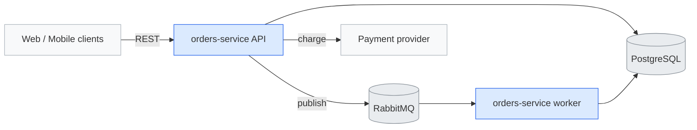
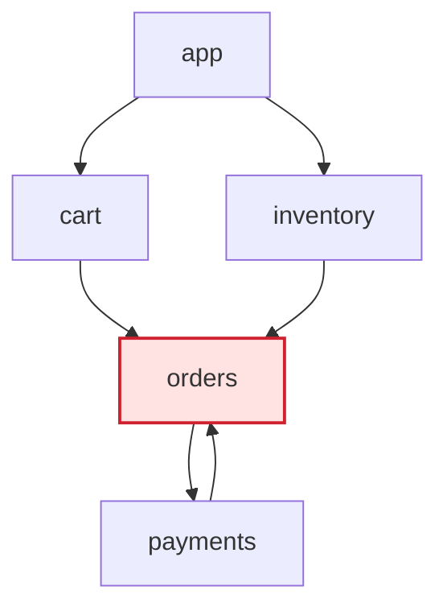
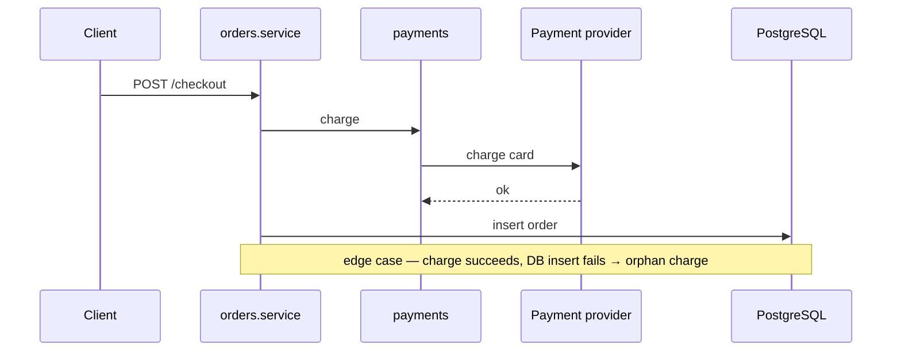

# orders-service — architecture blueprint (example)

> Synthetic demo of the tornhill format. The diagrams, flow, and findings below are
> illustrative — in a real run every node and finding cites a real `path:line`.
> Click links resolve against the analyzed repo (here they are placeholders).

## L1 — System context

## L3 — Components

> Generated by `tornhill-mine-graph.py --format mermaid` from `graph.json` (the
> deterministic module-import substrate). `orders` is auto-marked `:::hot` because
> its degree is above the module median.

## Findings

- **[high]** `orders` is a churn × centrality hotspot — high commit churn AND
  high fan-in (cart, inventory, payments all import it). Decompose by
  responsibility. _Evidence: 88 churn touches; in-degree 3 from `graph.json`
  (centrality_quality: approx); top-ranked by `tornhill-join-risk.py`
  (percentile-rank product)._
- **[medium]** **Hidden coupling**: `payments.service` co-changes with
  `inventory.reservation` in 6 commits despite no structural link — a checkout
  invariant is split across two modules. _Evidence: co_change confidence 0.85._
- **[medium]** Checkout flow charges the payment provider before the DB
  transaction commits — a failure between the two leaves a charge with no order.
  _Evidence: see flow below._

## Flows

### Checkout

